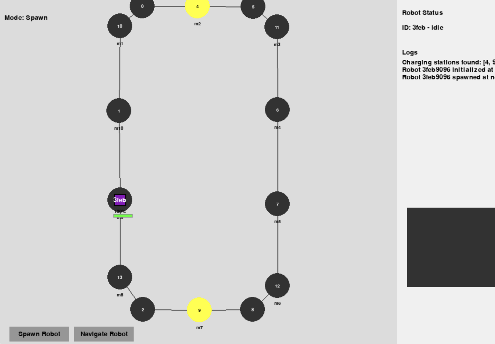
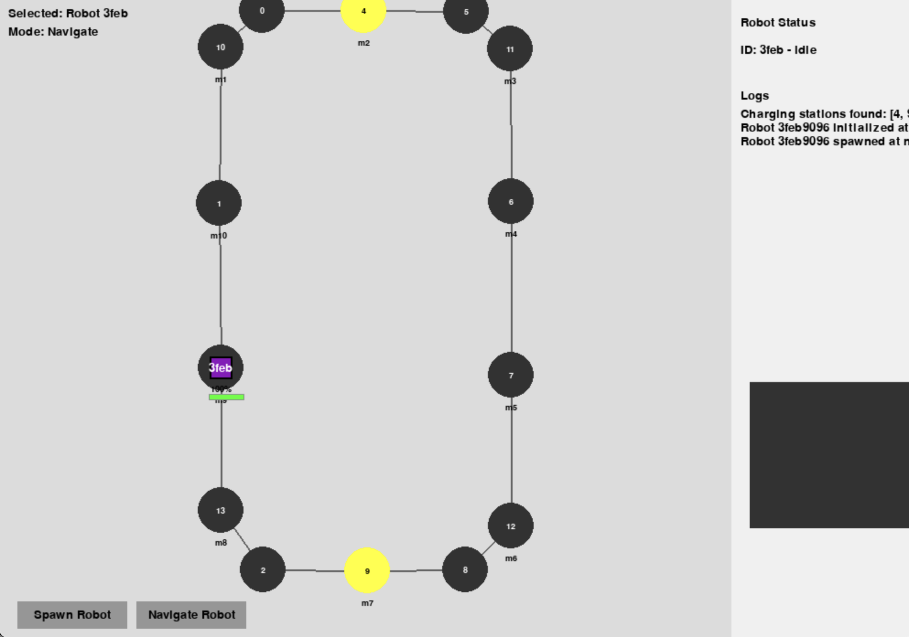
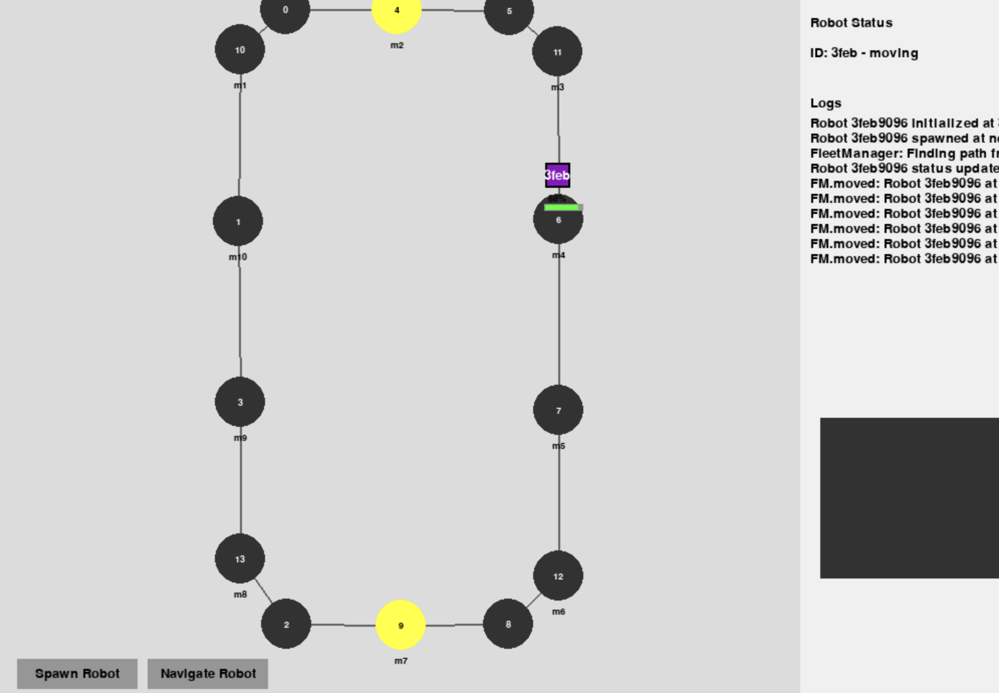
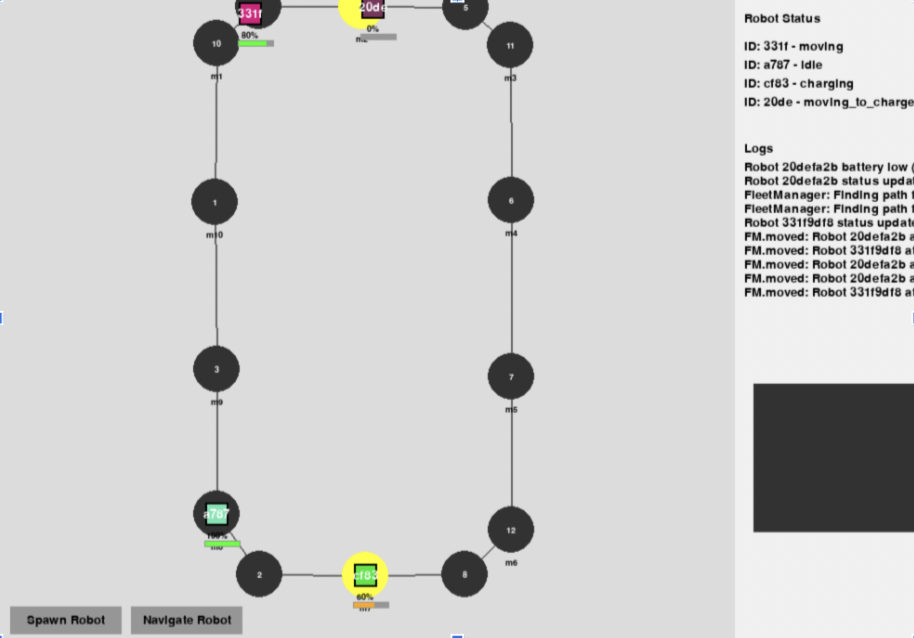

# GoatPSGHackathon_22PW27 - Autonomous Robot Fleet Management System

## Overview

This project implements a visual GUI system for managing a fleet of autonomous robots operating within a defined navigation graph. Robots can be spawned, assigned navigation tasks, and their status (location, battery level, status) can be monitored through the graphical interface. The system also incorporates basic traffic management to prevent collisions.

## Demo Video Link : 

https://www.loom.com/share/97d93eacf548474d9fa1196340208662

## Setup Instructions

1.  **Clone the Repository:**
    ```bash
    git clone https://github.com/Praneetha-NM/GoatPSGHackathon_22PW27
    cd GoatPSGHackathon_22PW27
    ```

2.  **Install Dependencies:**
    ```bash
    pip install -r requirements.txt
    ```

3.  **Run the GUI:**
    ```bash
    python src/main.py
    ```

## GUI Commands for Testing

The GUI provides several interactive elements for testing the robot fleet management system:

### 1. Spawning Robots

* **Action:** Click the "**Spawn Robot**" button located at the bottom of the screen.
* **Effect:** The system enters "spawn" mode. Click on any unoccupied vertex (represented by a circle) in the navigation graph area to spawn a new robot at that location.
* **Visual Feedback:** A new colored rectangle representing the robot will appear on the clicked vertex. The robot's ID (first four characters) will be displayed within the rectangle, and its battery level will be shown as a bar below it. The "Mode" indicator at the top-left will briefly show "Spawn".

    
    *A robot spawned on a vertex after clicking "Spawn Robot" and then the vertex.*

### 2. Navigating Robots

* **Action:**
    1.  Click the "**Navigate Robot**" button located next to the "Spawn Robot" button.
    2.  The system enters "navigate" mode. Click on a robot in the graph area to select it. The "Selected" robot ID will be displayed at the top-left of the screen, and the "Mode" indicator will show "Navigate".
    3.  Click on a destination vertex (another circle in the graph) that is not currently occupied by another robot.
* **Effect:** The selected robot will be assigned a task to navigate to the chosen destination using the shortest path. The robot's status in the dashboard will change to "moving". The robot sprite will start moving towards the destination vertex along the lanes of the graph.
* **Traffic Management:** If a lane the robot needs to use is occupied by another robot, the robot will stop at the preceding vertex and its status in the dashboard will change to "waiting". It will resume movement once the lane becomes free.
* **Low Battery:** If you attempt to manually navigate a robot with a low battery (below the defined threshold), a notification will appear, and the navigation command will be rejected.
* **Visual Feedback:** The selected robot will be highlighted (you might need to implement visual highlighting). The robot sprite will move along the graph. The robot's status will be updated in the "Robot Status" section of the dashboard on the right. Notifications about low battery or occupied destinations will appear (printed in the console in this version).

    
    *A robot selected after clicking "Navigate Robot" and then the robot sprite.*

    
    *A robot moving towards a selected destination vertex.*

### 3. Monitoring Robot Status

* **Action:** Observe the "**Robot Status**" section in the dashboard on the right side of the GUI.
* **Effect:** This section displays a list of all spawned robots and their current status, including their ID (first four characters) and their current state (idle, moving, waiting, charging, task\_complete). The battery level of each robot is visually represented by a bar below its sprite in the graph area.

### 4. Monitoring Logs

* **Action:** Observe the "**Logs**" section in the dashboard below the "Robot Status".
* **Effect:** This section displays the last 10 log messages from the system, providing information about robot spawns, task assignments, movements, charging events, and traffic management events.

    
    *The "Robot Status" and "Logs" section of the dashboard displaying robot IDs and their current statuses and also the entries of the log*


